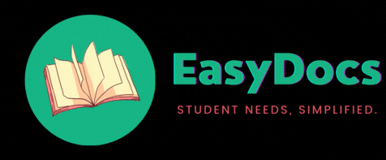
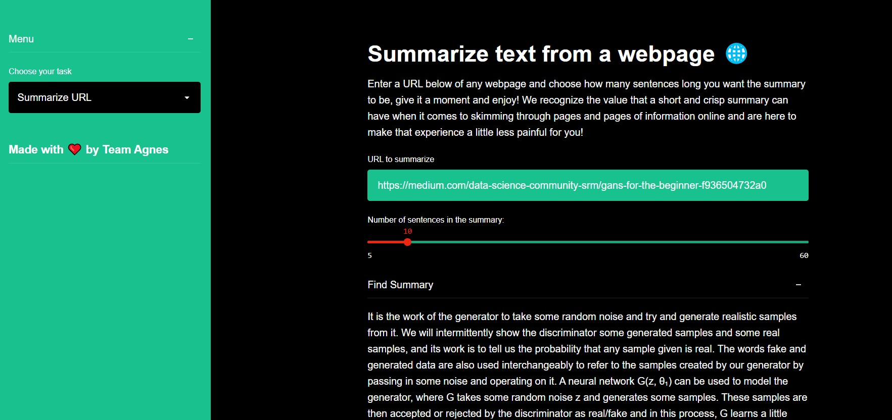
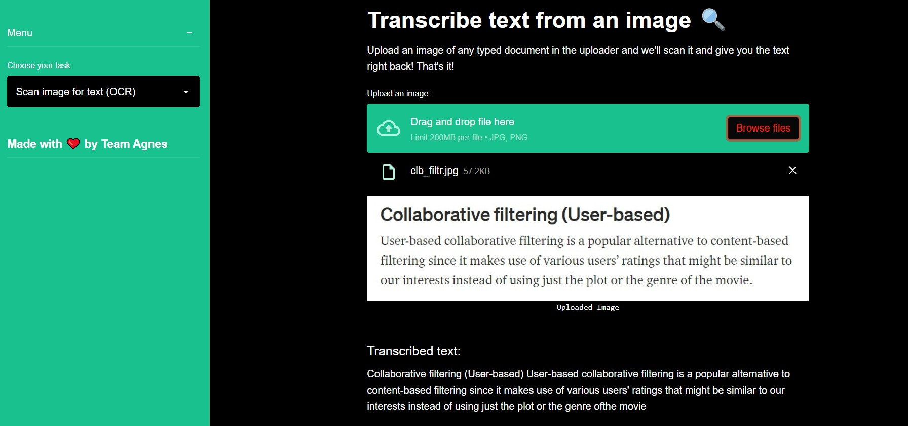
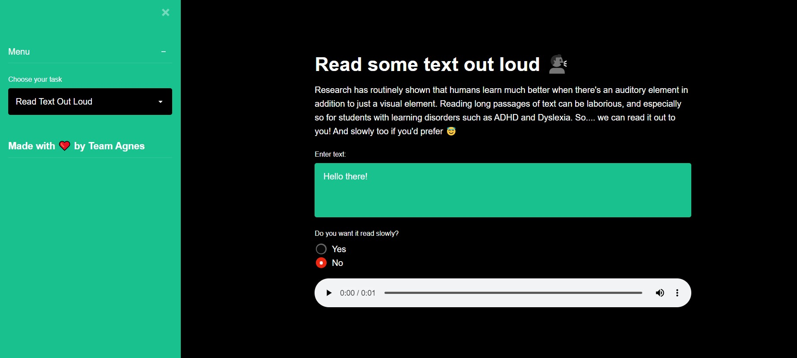
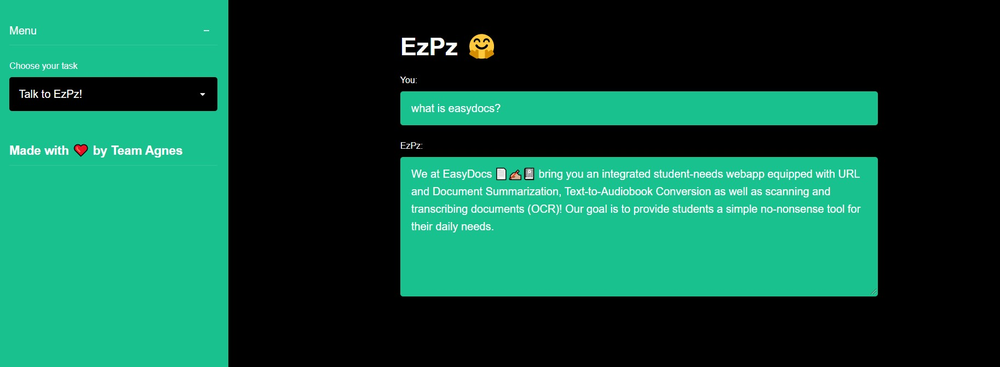

# EasyDocs

Team Agnes presents: EasyDocs - A student friendly Machine learning application like no other.
A convenient app for all your study needs: from document/text summarization to text-to-speech to OCR, we've got you covered ;)

## Problem Statement
In this digital age, when so many of us are experiencing classroom learning via online mode it is absolutely necessary to be able to manipulate and also convert documents from one form to another. Hence Team Agnes presents 'EasyDocs' a student-friendly application that enables users to - summarize documents, recognize text and images and convert text/PDF to audio books. As a fun addition, we have also developed 'EzPz' a chatbot, that can help users navigate and understand the importance of EasyDocs.

## Features of EasyDocs
Choose from 6 unique components:
- Summarize hyper-links to various Wikipedia pages, blogs or any page with textual content.

- Summarize any text document and save yourself the time and effort put into reading your lecture notes or articles.

- Convert the text in any image into a copy-paste friendly format without spending a dime! Ta-dah welcome to the OCR section.

- Feed text to EasyDocs and watch it get magically get converted into an audio file that you can play in the click of a button!

- Upload an entire PDF file and get it read out in your own pace(select 'yes' for slower pace) and download the file to listen to it on the go!

- Ooof! Too much information about the app right? Worry not! EzPz, the beloved EasyDocs chatbot, comes to the rescue with clear cut instructions as to what each module is used for and how they all work.

## Link to EasyDocs

EasyDocs has been deployed for commercial usage via Streamlit sharing and the working web application can be found here:
https://share.streamlit.io/adityashukzy/easy-docs/main/st_app.py

## Contributors

<table align="center">
<tr align="center">

<td width:25%>
Aditya Shukla

</td>

<td width:25%>

Pooja Ravi

</td>

</table>

## License
MIT © Aditya Shukla

This project is licensed under the MIT License - see the [License](LICENSE) file for details

	Made with ❤️ by Team Armada

